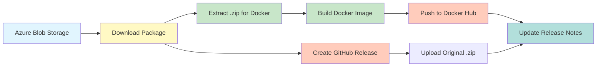
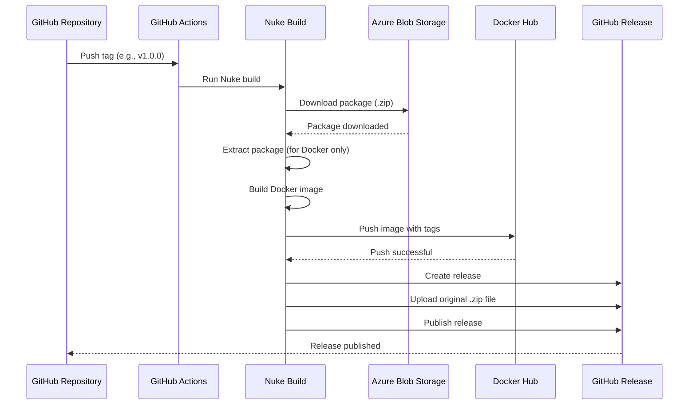

# Change: Migrate PCode CI/CD Build and Release Workflow

## Why

The hagicode-release project is a **release-only repository** that does not contain source code. Its purpose is to download pre-built packages from Azure Blob Storage, then publish them as Docker images and GitHub Releases. This separation allows the main hagicode project to focus on development while this repository handles distribution to multiple channels (Docker Hub, GitHub Releases).

## What Changes

- **ADDED**: Nuke build configuration (`nukeBuild/_build.csproj`, `build.cs`)
- **ADDED**: GitHub Actions workflow for release automation
- **ADDED**: Azure Blob Storage download adapter (downloads pre-built .zip packages)
- **ADDED**: Docker configuration files (Dockerfile, docker-compose.yml)
- **ADDED**: Nuke build targets for package download, Docker build, and publishing
- **ADDED**: Release automation with GitHub Release creation
- **ADDED**: Integration with Docker Hub for image publishing
- **ADDED**: Version tagging strategy (full version, minor, major, latest)
- **BUILD FRAMEWORK**: Nuke (https://nuke.build) - A cross-platform build automation system

## Architecture



## Code Flow



## Impact

- **Affected specs**: `cicd-build-release` (new capability)
- **Affected code**:
  - `.github/workflows/release.yml` (new) - GitHub Actions workflow
  - `nukeBuild/_build.csproj` (new) - Nuke build project
  - `nukeBuild/Build.cs` (new) - Main Nuke build definition
  - `nukeBuild/Adapters/AzureBlobAdapter.cs` (new) - Azure download adapter
  - `docker_deployment/Dockerfile` (new) - Container image definition
  - `docker-compose.yml` (new) - Development compose file
  - `ReleaseScripts/release_config.yml` (new) - Release configuration
- **Dependencies**:
  - Nuke build framework (cross-platform build automation)
  - Azure Blob Storage SDK (for downloading packages)
  - GitHub Actions
  - Docker Hub (registry: newbe36524)
  - .NET 10 SDK
- **Environment variables required**:
  - `AZURE_BLOB_SAS_URL` - Azure Blob Storage SAS URL for downloading
  - `DOCKER_USERNAME` / `DOCKER_PASSWORD` - Docker Hub credentials
  - `GITHUB_TOKEN` - GitHub API token

## Success Criteria

1. Packages are downloaded from Azure Blob Storage on version tag
2. Docker images are built from downloaded packages and pushed to Docker Hub
3. GitHub Releases are created automatically with proper version tagging
4. Release artifacts are uploaded to GitHub Releases
5. The workflow supports version tagging strategy (full, minor, major, latest)
6. The pipeline is reproducible and idempotent

## Migration Plan

1. Create directory structure for GitHub Actions workflows
2. Set up Nuke build project (`nukeBuild/`)
3. Implement Azure Blob Storage download adapter
4. Configure Docker image build from downloaded packages
5. Implement Nuke build targets (Download, Extract, DockerBuild, Release, etc.)
6. Configure GitHub Actions workflow to invoke Nuke
7. Set up repository secrets (Azure SAS URL, Docker Hub credentials)
8. Test the workflow with a test release

## Build Framework: Nuke

This project uses **Nuke** as the primary build automation framework. Nuke provides:

- **Cross-platform support**: Windows, Linux, macOS
- **C# based build definitions**: Type-safe, IDE-supported
- **Modular targets**: Composable build targets
- **CI/CD integration**: Automatic generation for GitHub Actions, Azure Pipelines, etc.
- **Docker integration**: Native support for container builds

### Nuke Build Targets

| Target | Description |
|--------|-------------|
| `Download` | Download package from Azure Blob Storage |
| `Extract` | Extract downloaded .zip package |
| `DockerBuild` | Build container images from extracted files |
| `DockerPush` | Push images to Docker Hub |
| `GitHubRelease` | Create GitHub Release with artifacts |
| `Release` | Orchestrator target (Download → Extract → DockerBuild → DockerPush → GitHubRelease) |

### Usage

Nuke provides a **cross-platform CLI** that works on Windows, Linux, and macOS. No platform-specific bootstrap scripts are required.

```bash
# Install Nuke global tool (one-time setup)
dotnet tool install Nuke.GlobalTool --global

# Local development
nuke                          # List all targets
nuke Download                 # Download from Azure
nuke DockerBuild              # Build Docker image
nuke Release                  # Full release pipeline

# CI/CD (GitHub Actions)
nuke --target Release         # Execute release workflow
```

**Note**: Nuke's global CLI replaces the need for `build.sh`/`build.ps1` bootstrap scripts. The `nuke` command works identically across all platforms.

### Azure Blob Storage Integration

The project downloads pre-built packages from Azure Blob Storage using SAS URL authentication:

- **Source**: Azure Blob Storage container with versioned packages
- **Format**: .zip files containing compiled application
- **Naming**: `{version}/hagicode-{version}.zip` (e.g., `1.0.0/hagicode-1.0.0.zip`)
- **Authentication**: SAS URL with Read permissions
- **Index**: `index.json` file listing available versions

**Download Workflow**:
1. Read `index.json` from Azure Blob Storage
2. Find the package matching the current version tag
3. Download the .zip file to local temporary directory
4. Extract contents for Docker image build

### Docker Hub Publishing

Built images are pushed to Docker Hub with multiple tags:

| Tag Pattern | Example | Description |
|-------------|---------|-------------|
| Full version | `v1.2.3` | Exact version match |
| Minor version | `v1.2` | Latest patch in minor version |
| Major version | `v1` | Latest minor/patch in major version |
| `latest` | `latest` | Most recent stable release |

**Pre-release handling**: Tags containing `-alpha`, `-beta`, or `-rc` do not update the `latest` tag.

### GitHub Release Automation

Releases are created automatically when version tags are pushed:

- **Trigger**: Git tag matching pattern `v*.*.*`
- **Title**: Version number (e.g., `v1.0.0`)
- **Notes**: Auto-generated from version information
- **Artifacts**: Original .zip package from Azure (NOT extracted files) uploaded as release asset
- **Pre-release**: Detected from version suffix (`-alpha`, `-beta`, `-rc`)

**Important**: GitHub Releases contain the original compressed package (.zip) as downloaded from Azure Blob Storage. The extraction process is **only** used for building Docker images, not for release artifacts.
