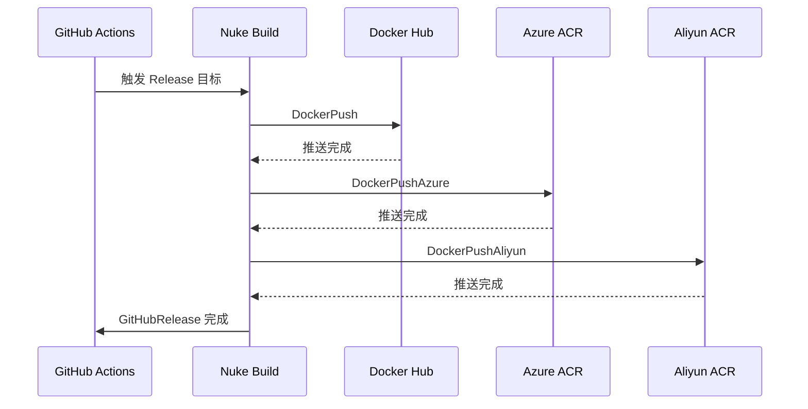

# 统一 Docker 镜像多仓库发布流程

## 概述

将 Docker 镜像同步逻辑从 `pcode-docs` 仓库的独立 GitHub Actions workflow 迁移到 `hagicode-release` 仓库的 Nuke 构建系统中，实现统一的发布流程。

## 背景

### 当前架构状态

**Hagicode Release** 项目目前采用以下发布流程：

1. **Docker Hub 发布**：通过 Nuke 构建系统将镜像推送到 Docker Hub (`docker.io/newbe36524/hagicode`)
2. **独立的同步工作流**：在 `pcode-docs` 仓库中，存在一个独立的 GitHub Actions workflow (`sync-docker-acr.yml`)，负责将 Docker Hub 镜像同步到：
   - Azure Container Registry (`hagicode.azurecr.io`)
   - Alibaba Cloud Container Registry (`registry.cn-hangzhou.aliyuncs.com`)

### 技术栈现状

| 组件 | 当前状态 |
|------|----------|
| 构建系统 | Nuke 9.0.4 (C#) |
| 主要镜像仓库 | Docker Hub |
| 同步机制 | 独立的 GitHub Actions workflow + image-syncer 工具 |
| 同步触发方式 | 定时任务 (每日 UTC 00:00) + 手动触发 |

## 问题

### 现有架构存在的局限性

1. **流程分散**：Docker 镜像的多仓库发布逻辑分散在两个不同的仓库中
   - 主要发布流程：`hagicode-release` 仓库
   - 同步流程：`pcode-docs` 仓库

2. **延迟同步**：镜像同步依赖定时任务，存在以下问题：
   - 新版本发布后，最多延迟 24 小时才能同步到 ACR
   - 需要手动触发才能实现即时同步

3. **维护复杂度**：
   - 需要在两个仓库中维护相关配置
   - 同步逻辑与主要发布流程分离，缺乏统一性

4. **工具依赖**：使用第三方 `image-syncer` 工具，增加外部依赖

## 解决方案

### 迁移计划

将 `pcode-docs` 仓库中的 Docker 镜像同步逻辑迁移到 `hagicode-release` 的 Nuke 构建系统中。

### 具体实施

1. **创建新的 Nuke 目标**

   在 `Build.Targets.Docker.cs` 中添加以下目标：

   | 目标名称 | 描述 | 依赖 |
   |---------|------|------|
   | `DockerPushAliyun` | 推送镜像到阿里云容器镜像服务 | `DockerBuild` |
   | `DockerPushAzure` | 推送镜像到 Azure Container Registry | `DockerBuild` |
   | `DockerPushAll` | 推送镜像到所有注册表 | `DockerPush`, `DockerPushAliyun`, `DockerPushAzure` |

2. **修改目标依赖关系**

   ```mermaid
   graph LR
       A[Download] --> B[Extract]
       B --> C[DockerBuild]
       C --> D[DockerPush]
       C --> E[DockerPushAliyun]
       C --> F[DockerPushAzure]
       D --> G[GitHubRelease]
       E --> G
       F --> G
       G --> H[Release]
   ```

3. **配置新增环境变量**

   扩展 `.env.example` 文件：

   ```bash
   # 现有变量
   AZURE_BLOB_SAS_URL=
   DOCKER_USERNAME=
   DOCKER_PASSWORD=
   GITHUB_TOKEN=

   # 新增阿里云 ACR 变量
   ALIYUN_ACR_USERNAME=
   ALIYUN_ACR_PASSWORD=
   ALIYUN_ACR_REGISTRY=registry.cn-hangzhou.aliyuncs.com

   # 新增 Azure ACR 变量
   AZURE_ACR_USERNAME=
   AZURE_ACR_PASSWORD=
   AZURE_ACR_REGISTRY=hagicode.azurecr.io
   ```

4. **实现多注册表推送逻辑**

   在 `Build.Helpers.cs` 中添加辅助方法：

   ```csharp
   // 推送镜像到指定注册表
   void PushToRegistry(string image, string registry, string username, string password);

   // 为镜像添加注册表前缀标签
   string TagImageForRegistry(string sourceImage, string targetRegistry);
   ```

5. **更新 Release 目标**

   修改 `Release` 目标依赖，确保在完成 GitHub Release 之前完成所有镜像推送：

   ```csharp
   Target Release => _ => _
       .DependsOn(DockerPushAll, GitHubRelease);
   ```

### 执行流程

发布新版本时的完整流程：



## 影响

### 预期收益

1. **统一发布流程**
   - 所有 Docker 镜像发布逻辑集中在单一仓库
   - 简化维护和故障排查

2. **即时同步**
   - 消除定时同步的延迟
   - 新版本发布后立即同步到所有容器注册表

3. **减少外部依赖**
   - 移除对 `image-syncer` 工具的依赖
   - 利用 Docker 原生的多标签和推送能力

4. **更好的可观测性**
   - 所有发布步骤在单一 Nuke 执行中可见
   - 统一的日志和错误处理

### 风险评估

| 风险 | 缓解措施 |
|------|----------|
| 新增环境变量配置 | 在 `.env.example` 中提供清晰注释 |
| 推送失败可能阻塞发布 | 使用 Nuke 的错误处理机制，实现部分失败容错 |
| 现有 pcode-docs workflow 失效 | 在迁移完成后通知相关团队更新工作流 |

### 后续清理

迁移完成后：
- 在 `pcode-docs` 仓库中禁用或移除 `sync-docker-acr.yml` workflow
- 更新相关文档以反映新的发布流程

## 范围

### 包含内容

- 扩展 `Build.Targets.Docker.cs` 添加新的推送目标
- 在 `Build.Helpers.cs` 添加多注册表辅助方法
- 更新 `.env.example` 添加新的环境变量
- 修改 `Build.cs` 的 Release 目标依赖
- 更新 GitHub Actions workflow 导入新的 secrets

### 不包含内容

- 修改 Docker 镜像构建逻辑
- 更新镜像标签策略
- 修改 `pcode-docs` 仓库的 workflow（仅通知相关团队）

## 相关文件

### 新增文件

无

### 修改文件

| 文件路径 | 修改类型 | 说明 |
|---------|---------|------|
| `nukeBuild/Build.Targets.Docker.cs` | 扩展 | 添加 `DockerPushAliyun`, `DockerPushAzure`, `DockerPushAll` 目标 |
| `nukeBuild/Build.Helpers.cs` | 扩展 | 添加多注册表推送辅助方法 |
| `nukeBuild/Build.cs` | 修改 | 更新 Release 目标依赖，添加新参数 |
| `.env.example` | 扩展 | 添加阿里云和 Azure ACR 环境变量 |
| `.github/workflows/hagicode-server-publish.yml` | 重新生成 | 导入新的 secrets |

## 验收标准

1. **功能验证**
   - `./build.sh DockerPushAll` 成功推送到所有注册表
   - 本地测试所有推送目标可独立执行
   - 镜像在所有注册表中正确打标签

2. **CI/CD 验证**
   - GitHub Actions workflow 成功导入新 secrets
   - 发布 tag 后自动推送到所有注册表
   - 单个注册表推送失败不影响其他注册表

3. **文档验证**
   - `.env.example` 包含所有必需的环境变量及注释
   - 相关团队已收到 pcode-docs workflow 迁移通知

## 时间估算

| 任务 | 预估工作量 |
|------|-----------|
| 添加新 Nuke 目标和辅助方法 | 2-3 小时 |
| 更新环境变量和配置 | 30 分钟 |
| 更新 GitHub Actions workflow | 30 分钟 |
| 测试和验证 | 1-2 小时 |
| **总计** | **4-6 小时** |
