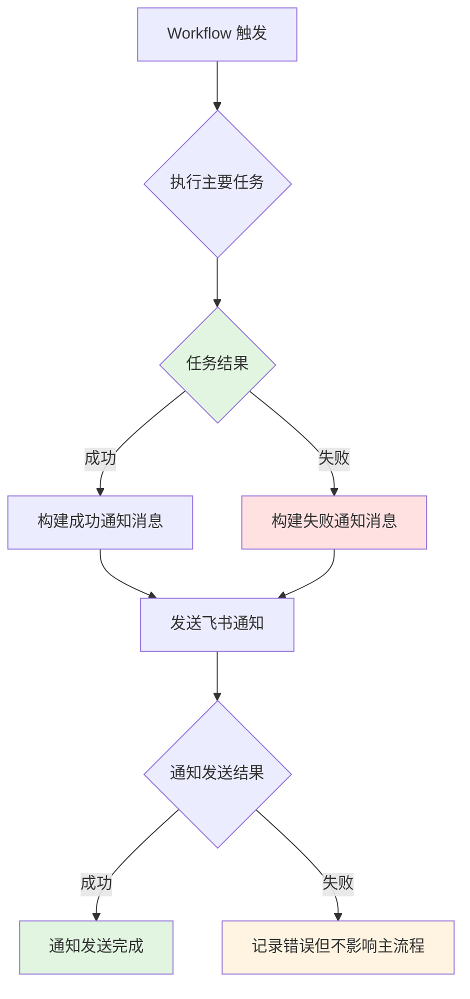
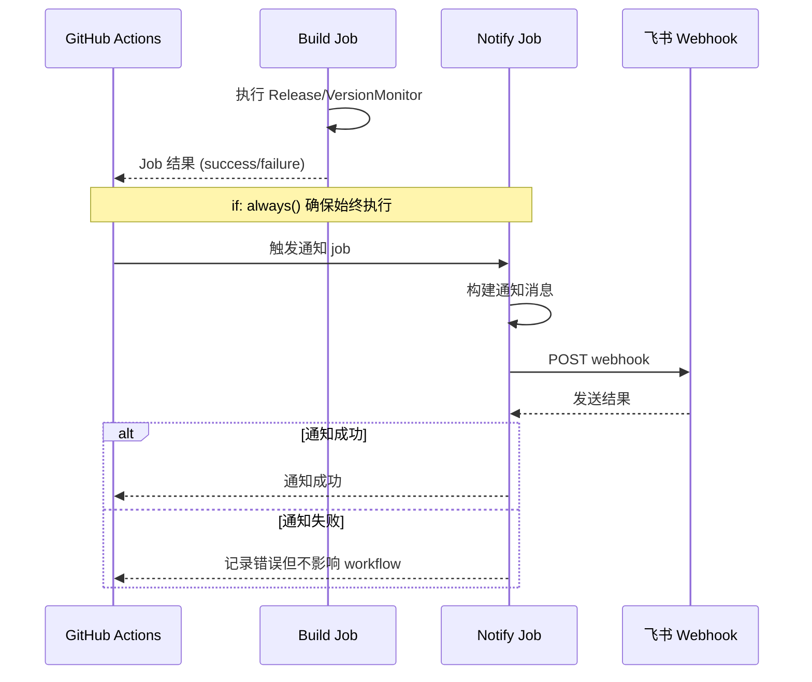

# Change: Hagicode Release 集成飞书通知

## Why

hagicode-release 仓库在关键的 release flow 结束后（如 Release、DockerPushAll 等关键流程），缺少主动向团队汇报结果的机制。当前团队成员需要手动检查 GitHub Actions 日志来确认发布状态，导致运维效率低下，特别是在发布失败时，延迟发现问题会延长问题排查和修复的时间。

## What Changes

- 在 hagicode-release 仓库中集成飞书通知功能
- 在关键 workflows 结束时主动发送飞书通知
- 添加 `FEISHU_WEBHOOK_URL` secret 配置
- 使用复用的飞书通知机制（类似 haginotifier 的设计模式）

**BREAKING**: 无破坏性变更

### 具体变更内容

1. **GitHub Actions Workflows 修改**:
   - 修改 `.github/workflows/hagicode-server-publish.yml` 添加通知 job
   - 修改 `.github/workflows/version-monitor.yml` 添加通知 job

2. **Secrets 配置**:
   - 添加 `FEISHU_WEBHOOK_URL` 到仓库 Secrets

3. **通知集成点**:
   - Release 流程结束时（无论成功失败）
   - Version Monitor 发现新版本时（有版本差异时）
   - Workflow 失败时（无论何种场景）

## Code Flow Changes

### 飞书通知集成流程

### Workflow 通知时序图

### 代码变更清单

| 文件路径 | 变更类型 | 变更原因 | 影响范围 |
|---------|---------|---------|---------|
| `.github/workflows/hagicode-server-publish.yml` | 修改 | 添加飞书通知 job，在 Release 流程结束后发送通知 | 发布流程 |
| `.github/workflows/version-monitor.yml` | 修改 | 添加飞书通知 job，在版本监控流程结束后发送通知 | 版本监控 |
| 仓库 Secrets | 新增 | 添加 `FEISHU_WEBHOOK_URL` 用于飞书 webhook 调用 | 通知配置 |

## Impact

### 受影响的 specs

- `specs/release-workflow/spec.md` - Release 流程规范（需创建）

### 受影响的代码

- `.github/workflows/hagicode-server-publish.yml` - 主要发布工作流
- `.github/workflows/version-monitor.yml` - 版本监控工作流

### 正面影响

- **提高运维效率**: 团队可实时收到发布结果通知，无需手动检查
- **加快问题响应**: 发布失败时可立即知晓并采取行动
- **增强可观测性**: 所有关键 flow 的执行结果都有记录和通知
- **统一通知标准**: 使用与组织内其他仓库一致的通知方式
- **减少通知噪音**: Version Monitor 仅在发现版本差异时通知，避免正常运行时的无效通知

### 风险

- **通知发送失败不影响主流程**: 使用 `if: always()` 和适当的错误处理确保通知失败不影响发布流程
- **Webhook 配置错误**: 需要确保 `FEISHU_WEBHOOK_URL` 配置正确
- **消息格式**: 需要设计清晰、结构化的消息格式
- **通知噪音控制**: Version Monitor 仅在发现版本差异时通知，避免正常运行时产生不必要的通知

### 迁移计划

1. 配置飞书 webhook URL
2. 在仓库中添加 Secret
3. 更新 workflows
4. 测试通知功能
