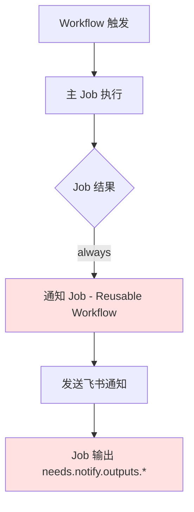
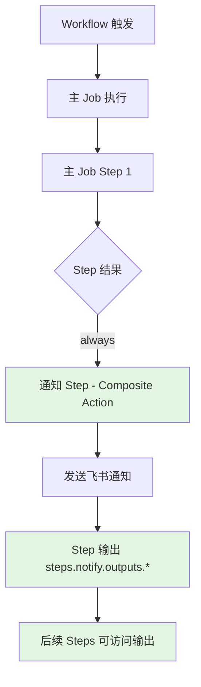
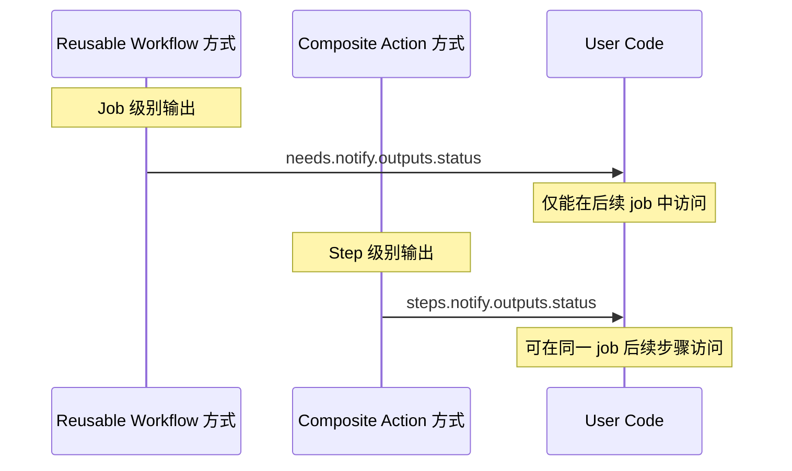

# Change: 迁移通知方式为 Composite Action

## Why

当前 Hagicode Release 仓库使用 **Reusable Workflow**（可复用工作流）方式调用 haginotifier 进行飞书通知。这种方式存在以下限制：

1. **输出访问复杂**：必须使用 `needs.<job-id>.outputs.<output-name>` 语法访问输出，无法在同一 job 的后续步骤中使用
2. **版本管理不便**：需要使用 `@main` 分支引用，无法使用语义化版本标签（如 `@v1`、`@v1.0.0`）
3. **执行效率较低**：Reusable Workflow 需要在单独的 job 中运行，增加了工作流的复杂度和执行时间
4. **灵活性受限**：无法像 Action 一样在步骤级别灵活组合使用

haginotifier 项目已经提供了 Composite Action 方式（`@v1` 版本），采用更符合 GitHub Actions 生态最佳实践的设计模式。

## What Changes

- 将通知方式从 **Reusable Workflow** 迁移到 **Composite Action**
- 更新三个工作流文件的通知调用方式
- 修改输出参数访问方式（从 job 级别改为 step 级别）
- 添加语义化版本控制支持

**BREAKING**: 工作流中通知调用方式发生破坏性变更，需要同步修改输出访问方式

### 具体变更内容

1. **GitHub Actions Workflows 修改**:
   - 修改 `.github/workflows/hagicode-server-publish.yml` 中的通知 job 为 step
   - 修改 `.github/workflows/docker-build.yml` 添加通知 step（当前无通知）
   - 修改 `.github/workflows/version-monitor.yml` 中的通知 job 为 step

2. **调用方式变更**:

   **变更前 (Reusable Workflow)**:
   ```yaml
   feishu-notify:
     name: Send Feishu Notification
     uses: HagiCode-org/haginotifier/.github/workflows/notify.yml@main
     needs: ubuntu-latest
     if: always()
     with:
       msg_type: 'interactive'
       title: '发布成功'
       message: '...'
     secrets:
       FEISHU_WEBHOOK_URL: ${{ secrets.FEISHU_WEBHOOK_URL }}
   ```

   **变更后 (Composite Action)**:
   ```yaml
   - name: Send Feishu Notification
     id: feishu-notify
     uses: HagiCode-org/haginotifier@v1
     if: always()
     with:
       msg_type: 'interactive'
       title: '发布成功'
       message: '...'
     env:
       FEISHU_WEBHOOK_URL: ${{ secrets.FEISHU_WEBHOOK_URL }}
   ```

3. **输出访问方式变更**:

   | Reusable Workflow | Composite Action |
   |-------------------|------------------|
   | `needs.notify.outputs.status` | `steps.feishu-notify.outputs.status` |
   | `needs.notify.outputs.timestamp` | `steps.feishu-notify.outputs.timestamp` |
   | `needs.notify.outputs.response` | `steps.feishu-notify.outputs.response` |

## Code Flow Changes

### Reusable Workflow 方式（当前）



### Composite Action 方式（目标）



### 输出访问方式对比



### 架构差异对比

| 特性 | Reusable Workflow | Composite Action |
|------|-------------------|------------------|
| 调用级别 | Job 级别 | Step 级别 |
| 输出作用域 | Job 间 (needs) | Job 内 (steps) |
| 版本管理 | 分支引用 (@main) | 语义化版本 (@v1) |
| 执行效率 | 需要单独 job | 同 job 内执行 |
| 组合灵活性 | 低（必须独立 job） | 高（可与其他 step 组合） |
| 环境变量传递 | secrets | env |

## Impact

### 受影响的 specs

- `specs/release-workflow/spec.md` - Release 流程规范（通知调用方式）

### 受影响的代码

| 文件路径 | 变更类型 | 变更原因 | 影响范围 |
|---------|---------|---------|---------|
| `.github/workflows/hagicode-server-publish.yml` | 修改 | 将通知 job 改为 step，修改输出访问方式 | 发布流程 |
| `.github/workflows/docker-build.yml` | 修改 | 添加通知 step（当前无通知） | Docker 构建验证 |
| `.github/workflows/version-monitor.yml` | 修改 | 将通知 job 改为 step，修改输出访问方式 | 版本监控 |

### 正面影响

- **更好的版本控制**：可以使用语义化版本标签（`@v1`、`@v1.0.0`）锁定 Action 版本
- **更快的执行速度**：Composite Action 是预编译的 JavaScript，无需运行时编译，且在同一 job 内执行减少上下文切换
- **更灵活的组合**：可以在同一 job 的多个步骤中使用，便于与其他操作组合
- **更简单的输出访问**：使用 `steps.*.outputs.*` 语法，更符合 GitHub Actions 标准
- **符合生态最佳实践**：遵循 GitHub Actions 生态系统的标准模式

### 风险

- **破坏性变更**：需要修改所有使用通知的工作流文件和输出访问方式
- **测试需求**：需要在更新后验证所有工作流正常执行
- **行为差异**：Composite Action 与 Reusable Workflow 在某些边界情况下行为可能不同

### 迁移计划

1. 确认 `haginotifier` 已发布 `@v1` 版本的 Action
2. 更新 `.github/workflows/hagicode-server-publish.yml`
3. 更新 `.github/workflows/docker-build.yml`
4. 更新 `.github/workflows/version-monitor.yml`
5. 在测试分支验证所有工作流正常执行
6. 合并到 `main` 分支

### 回滚方案

如遇问题可快速回退：
- 将调用方式改回 `uses: HagiCode-org/haginotifier/.github/workflows/notify.yml@main`
- 将通知 step 改回独立 job
- 将输出访问方式改回 `needs.*.outputs.*`
